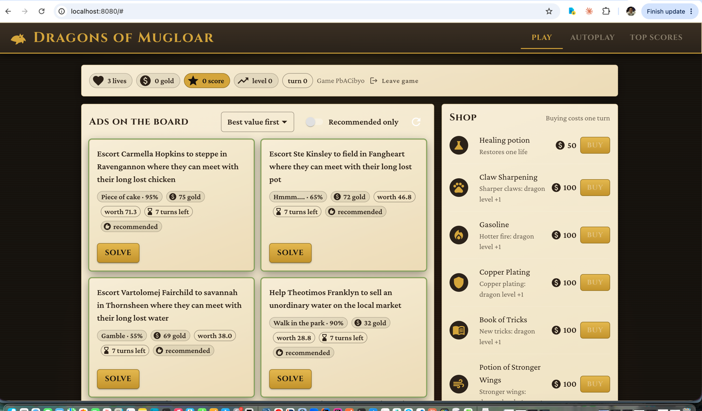
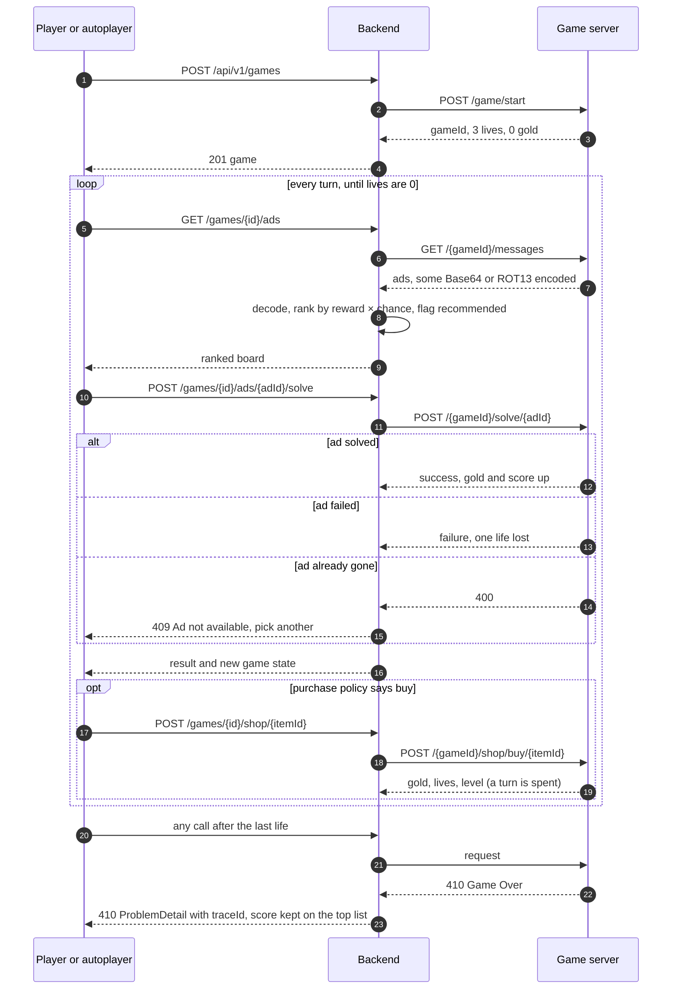
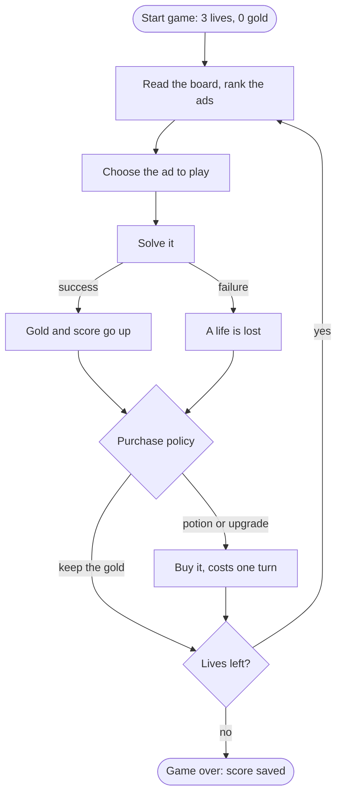
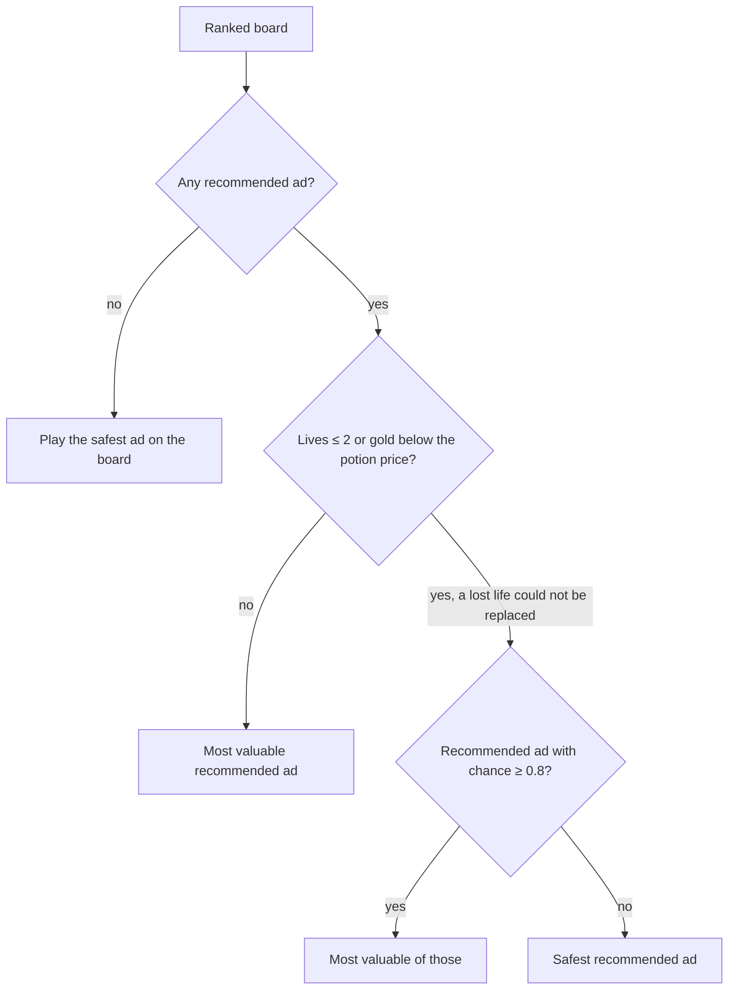
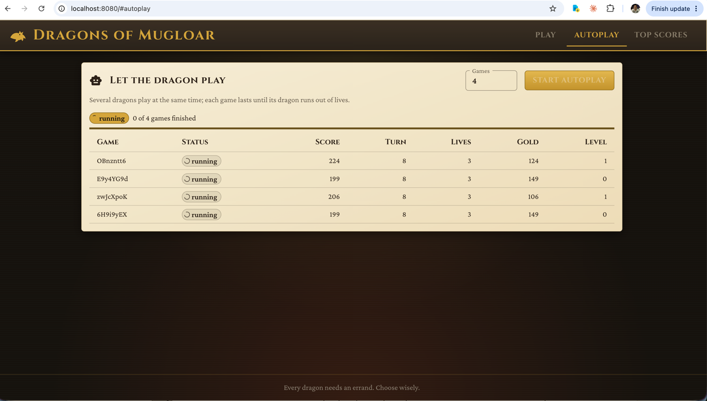
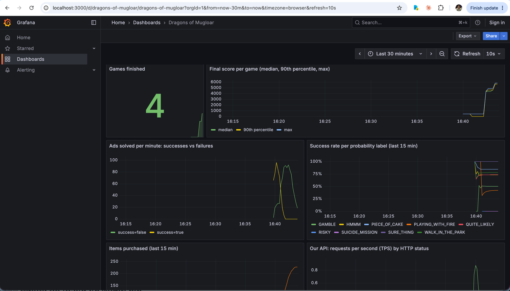

# Dragons of Mugloar

[](https://github.com/NijatSalman/dragons-of-mugloar-fullstack/actions/workflows/ci.yml)

A full-stack solution to the [Dragons of Mugloar](https://dragonsofmugloar.com/) game: a player (or the built-in
autoplayer) **starts** a game, **reads** a board of ads, **solves** the best one, **buys** potions and upgrades with the
gold, and repeats until the dragon's lives run out. The backend wraps the public game API and owns the strategy; the
web app shows the board with every ad's odds and value, lets the dragon play on its own, and keeps a top-scores list.

```
Browser (React) ──HTTP──▶ Backend (Spring Boot) ──HTTP──▶ dragonsofmugloar.com
                          decode → rank → choose → solve → buy → store
Prometheus ◀── /actuator/prometheus            Grafana ◀── Prometheus
```

The task asks for a program that reliably scores 1000+ points; the autoplayer finishes between roughly 4000 and 6800.

## 🧰 Technology choices

| Technology | Version | Why |
|---|---|---|
| Java | 21 | current LTS; virtual threads make one-thread-per-game cheap |
| Spring Boot | 4.1.1 | latest generation; `RestClient`, `ProblemDetail`, Micrometer Tracing and virtual threads are built in |
| Spring Web MVC + `RestClient` | managed | the auto-configured builder adds tracing propagation and HTTP client metrics for free |
| Bean Validation | managed | declarative rules on path and query parameters (`@Pattern`, `@Min`, `@Max`) |
| Resilience4j | 2.4.0 | rate limiter and retries towards the game server, configured in YAML, no retry code in Java |
| Spring Cache | managed | the shop catalogue is static, fetched once per process |
| Micrometer Tracing (Brave) + Prometheus registry | managed | `traceId` in every log line, error body and response header; business metrics for Grafana |
| springdoc-openapi | 3.1.0 | Swagger UI generated from the code |
| Lombok | managed | `@Slf4j` and `@RequiredArgsConstructor` only; data types are records |
| JUnit 5, AssertJ, Mockito, MockMvc, `MockRestServiceServer` | managed | one toolkit for every backend test; the game server is the only thing ever faked |
| React + TypeScript | 19 / 6 | the UI; state with `useReducer` and Context, no state library and no router |
| Vite + Vitest + React Testing Library | 8 / 5 / 16 | build, dev proxy and tests from one toolchain; oxlint from the Vite template |
| Material UI | 9 | accessible, responsive components; one theme file owns colours and typography |
| Docker Compose | | app, Prometheus 3.5 and Grafana 12.1 with a provisioned dashboard |
| GitHub Actions | | backend and frontend checks on every pull request, image build on `main` |

## 🚀 Getting started

Requires Docker; Java, Node and Gradle run inside the build.

```bash
# 1. build and start everything (app, Prometheus, Grafana)
docker compose up --build

# 2. open the game
open http://localhost:8080

# 3. or start a game from the terminal
curl -s -X POST http://localhost:8080/api/v1/games | jq
```

| Service | URL | Notes |
|---|---|---|
| Web app and API | http://localhost:8080 | `/swagger-ui.html` for the API |
| Prometheus | http://localhost:9090 | scrapes the app every 15 s |
| Grafana | http://localhost:3000 | dashboard **Dragons of Mugloar**; anonymous viewer, admin/admin to edit |

Ports taken? `APP_PORT=8091 GRAFANA_PORT=3001 docker compose up --build`.

### Development

```bash
./gradlew test && ./gradlew bootRun              # backend on 8080
cd frontend && npm ci && npm run dev             # UI on 5173, /api proxied to 8080
BACKEND_URL=http://localhost:8091 npm run dev    # when the backend runs elsewhere
```

### In the app

- **Play**: the board shows each ad's success chance, expected value and a *recommended* mark; risky ads can be hidden.
  Solve, shop, investigate reputation. The game is remembered in the browser, so a refresh continues it.
- **Autoplay**: let the dragon play 1 to 20 games at once and watch score, gold, level and lives update live.
- **Top scores**: the ten best finished games since the backend started, marked as played by hand or by the dragon.



## 🧪 Testing

```bash
./gradlew test                 # 135 tests, report in build/reports/tests/test, coverage in build/reports/jacoco
cd frontend && npm test        # 83 tests
```

| Layer | Tooling | Asserts |
|---|---|---|
| Domain and strategy | JUnit, AssertJ | ranking, choice and purchase rules on hand-built boards with real ad texts |
| Services and repositories | Mockito | orchestration, metrics, state kept per game |
| Game server client | `MockRestServiceServer` | decoding, every error mapping, cache, rate limiter |
| Controllers | `@WebMvcTest` | validation, status codes, `ProblemDetail` shape |
| End to end | `@SpringBootTest` + recorded server JSON | start → ranked board → shop → solve → buy → stored state; game over; unknown game |
| Frontend | Vitest + React Testing Library | reducer, API client, every component, the polling hook |

The game server is the only thing ever faked, using JSON recorded from the real one. Test names read
`<subject><Behaviour>[When<Condition>]`, for example `chooseAdPicksOnlySafeAdsWhenLivesAreLow`.

## 🗺️ How a game flows



## 🐉 How the dragon plays

The autoplayer uses exactly the services the UI uses. One game is a strict sequence, because every server call
advances that game's turn; independent games run in parallel, one virtual thread each.



### Ranking and choosing an ad

Every ad has a probability label: `Sure thing`, `Piece of cake`, `Walk in the park`, `Quite likely`, `Hmmm....`,
`Gamble`, `Risky`, `Rather detrimental`, `Playing with fire`, `Suicide mission`, `Impossible`. Each maps to a success
chance from 1.0 down to 0.0; an unknown label counts as 0.5. An ad's **value** is `reward × chance`. It is
**recommended** when the chance is at least 0.55, it survives to the next turn (`expiresIn ≥ 2`) and it is honest work
(no stealing or kidnapping, which hurt reputation). The same ranking drives the UI highlights and the autoplayer, so
they never disagree.



The fallback to the safest ad matters: late in a game the board sometimes turns hostile ("Help defending the town from
the intruders", all `Impossible`). The game says to play until the lives run out, so the dragon keeps playing rather
than stopping with lives in hand; the score already earned stays.

### What to buy

Staying alive comes first, then upgrades in a fixed order. The dragon's level tells how many upgrades it already owns,
so the policy needs no memory.

| Situation | Purchase |
|---|---|
| lives ≤ 2 and gold ≥ 50 | healing potion `hpot` |
| level < 5 and gold ≥ 150 | next 100-gold upgrade: `cs`, `gas`, `wax`, `tricks`, `wingpot` |
| level ≥ 5 and gold ≥ 350 | next 300-gold upgrade: `ch`, `rf`, `iron`, `mtrix`, `wingpotmax` |
| otherwise | keep the gold |

The gold floors sit above the item prices on purpose: a purchase never leaves the dragon unable to afford the next
potion. All thresholds are configuration (`autoplay.*` in `application.yaml`), not code.

### Measured results

Sessions of 3 to 20 games were played against the live server on 6 and 7 September 2026 via
`POST /api/v1/autoplay/sessions?games=N`. Every game that ran until its lives were gone finished between about 4000 and
6800 points; the lowest observed final score was 4565 against a requirement of 1000. A game takes 5 to 10 minutes,
because the request rate towards the game server is capped (next section).



## 🏦 Game server limits and failures

The game server allows about 1150 requests per minute per address and then answers `429` with `Retry-After` for the
rest of the minute; ten unthrottled games hit that within 30 seconds and all died. Measured: 10 requests/s fails after
about 85 s, 6.5 requests/s runs clean.

| Concern | Setting |
|---|---|
| Rate limiter `gameApi` | 6 requests/s shared by all games and UI calls; callers wait up to 60 s for a permit |
| Retry `gameApiRead` | board and shop reads: 5 attempts at 2 s, 6 s, 18 s, 54 s on any server failure |
| Retry `gameApiWrite` | start, solve, buy, reputation: 4 attempts 20 s apart, **only** on `429`, because a refused request was never applied while a failed one might have been |
| Timeouts | 3 s connect, 10 s read |
| Shop catalogue | static on the server, cached after the first read |

| Server answer | Our answer |
|---|---|
| `404` unknown or expired game | `404 Not Found` |
| `400` ad no longer on the board | `409 Conflict`, the UI refreshes the board |
| `410 {"status":"Game Over"}` | `410 Gone` |
| `429` quota | retried; if still refused, `502 Bad Gateway` |
| anything else, timeout | `502 Bad Gateway` |

## 📚 API

Swagger UI at `/swagger-ui.html`. All routes are under `/api/v1`.

| Method | Path | Purpose |
|---|---|---|
| `POST` | `/games` | start a game, `201` |
| `GET` | `/games?limit=10` | top finished games by score |
| `GET` | `/games/{gameId}` | current state |
| `GET` | `/games/{gameId}/ads` | decoded, ranked board with chance, value and recommended flag |
| `POST` | `/games/{gameId}/ads/{adId}/solve` | solve an ad |
| `GET` | `/games/{gameId}/shop` | shop items |
| `POST` | `/games/{gameId}/shop/{itemId}` | buy an item |
| `POST` | `/games/{gameId}/reputation` | investigate reputation, costs a turn |
| `POST` | `/autoplay/sessions?games=N` | play N games (1 to 20) in the background, `202` |
| `GET` | `/autoplay/sessions/{sessionId}` | progress and per-game results |

Game and ad ids are validated as `[A-Za-z0-9]{1,64}` and session ids as UUIDs before anything is called. Errors are `application/problem+json`, always
with the trace id of the request:

```json
{
  "type": "about:blank",
  "title": "Gone",
  "status": 410,
  "detail": "Game is over: gameId=Oq3zV2Ke",
  "traceId": "68bd2c6f5c1a4d0e9f0b7a3c2d1e4f55"
}
```

## 📊 Observability

- Every log line follows one shape, `<Subject> <verb>: key=value, key=value`, and carries `traceId`/`spanId`. The same
  trace id is in the `X-Trace-Id` response header and in every error body, so a screenshot from the UI finds the logs.
- Metrics at `/actuator/prometheus`: `mugloar_ads_solved_total` (by probability label and success),
  `mugloar_items_purchased_total` (by item and success), `mugloar_game_score` summary, plus HTTP server and client
  timers and the Resilience4j limiter gauges.
- Grafana dashboard, provisioned from `monitoring/`: games finished, score percentiles, solved ads per minute, success
  rate per label, purchases, request rates and latencies towards our API and the game server, limiter permits, JVM heap.
  One autoplay session fills it.
- `/actuator/health` with liveness and readiness probes, `/actuator/info` with build info.



## 🏗️ Design notes

- **Architecture:** controller (HTTP boundary) → service (use cases) → strategy, repository and game server client.
  The domain package holds records and enums only, with no Spring and no I/O.
- **Interfaces only where a second implementation exists.** `GameApiClient` is an interface because tests replace it;
  services and repositories are concrete classes.
- **Two strategy classes** hold the decisions reviewers care about, `AdRecommender` and `PurchasePolicy`. They are
  pure, small and tested with boards copied from the real server; their thresholds are properties.
- **One error catalogue.** A single `@RestControllerAdvice` maps every typed exception to a `ProblemDetail`; no Spring
  default body or stack trace reaches the browser.
- **Autoplay in the background.** Starting a session returns `202` with a session id; games run one per virtual thread
  and the UI polls the session. Failures of one game never touch another.
- **Frontend state in one reducer.** Every screen reads the same state through one context; actions are plain
  functions that call the API and dispatch. Easy to test, nothing to learn.
- **UI copy speaks the game's language.** Errors show a short message and a *reference for support* (the trace id),
  never server or protocol words.

### Assumptions

- The undocumented `probability` and `encrypted` fields on ads are part of the contract; the chance per label is a
  heuristic (`Sure thing` 1.0 … `Impossible` 0.0, unknown 0.5) that produced the results above.
- "Repeats until lives run out" is taken literally: the autoplayer never stops with lives in hand.
- Ads that mention stealing or kidnapping damage reputation and are never recommended; reputation is shown
  on request and not used in the strategy.
- Games are single-user sessions identified by the server's game id; there are no accounts.

## 🗂️ Project layout

```
com.company.dragonsofmugloar
├── client/          GameApiClient + GameApiRestClient (RestClient, rate limiter, retries), MessageDecoder, dto/ payloads
├── config/          typed properties, cache, virtual-thread executor, Clock, OpenAPI
├── controller/      GameController, ShopController, AutoplayGameController, dto/ responses
├── domain/          ad/ (Ad, Probability, AdRecommendation), game/ (Game, results), shop/, autoplay/ (session, progress)
├── exception/       typed exceptions + ApiExceptionHandler (exception → ProblemDetail catalogue)
├── observability/   GameMetrics, TraceIdResponseFilter
├── repository/      in-memory games, boards, autoplay sessions
└── service/         GameService, AdService, ShopService, GamePlayer, AutoplayGameService, strategy/ (AdRecommender, PurchasePolicy)

frontend/src
├── api/             typed client, ApiError from ProblemDetail
├── state/           gameReducer, useGameActions, GameProvider, useGame
├── hooks/           useAutoplayPolling
├── components/      StatusBar, AdBoard, AdCard, ShopPanel, AutoplayPanel, LeaderboardPanel, banners
└── theme.ts         colours and typography

monitoring/          Prometheus config, Grafana datasource and dashboard provisioning
.github/workflows/   CI: backend, frontend, Docker image
```

## 🚢 The road to production

Each item was considered and left out on purpose; the table records what it would add and why it does not belong in
this exercise.

| Area | Improvement | Why not now |
|---|---|---|
| Storage | Postgres behind the existing repositories, so games and top scores survive a restart | The task is a game session, not a system of record; a database adds setup for reviewers without changing any behaviour |
| Autoplay control | `DELETE /autoplay/sessions/{id}` with a cooperative stop flag checked each turn, a Stop button in the UI | Sessions are short and bounded to 20 games; cancelling adds a state and a race for a rarely used action |
| Players | Names on the top-scores list and per-player history | No identity concept in the game; would invent a requirement |
| Strategy | Value an ad by expected gain (`chance × reward − (1 − chance) × potion price`); pass turns until a hostile board renews; spend surplus gold on long shots late in the game; tune label chances from measured outcomes | The simple rule already scores four to six times the requirement; each refinement needs its own measurement run to prove it helps |
| Live updates | Server-sent events for the autoplay view instead of polling every 3 s | Polling is simple, testable and cheap at this request volume |
| Caching | TTL on the shop catalogue cache (Caffeine) | The catalogue has never changed; a restart refreshes it |
| Resilience | Circuit breaker towards the game server | Rate limiter plus bounded retries already contain the only failure mode observed (quota) |
| Security | Authentication, actuator behind a management port | No user identity in the task; the app runs on a laptop or a private network |
